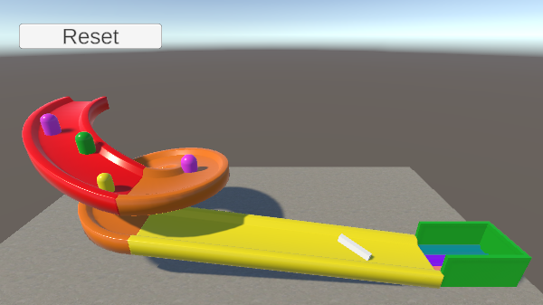

## You will make

Create a track for a ball to roll along. Add obstacles and a goal for the ball to reach.

You will:

+ Make a ball roll using physics
+ Use code to control the camera and ball
+ Build a level using 3D objects

--- no-print ---

Control the camera by clicking the left mouse button and moving the mouse. Control the movement of the ball using <kbd>WASD</kbd> (or <kbd>ZQSD</kbd>) or the arrow keys. 

<iframe allowtransparency="true" width="710" height="500" src="https://raspberrypilearning.github.io/unity-webgl/RainbowRun" scrolling="no" frameborder="0"></iframe>

--- /no-print ---

--- print-only ---

--- /print-only ---

### You will need

This project requires the Unity Editor, which can be installed from the Unity Hub. This is a large download and install, so we recommend you install it before starting this project.

You can follow our [Unity guide](https://projects.raspberrypi.org/en/projects/unity-guide){:target="_blank"} to install Unity Hub and the Unity Editor for your operating system.

You will also need to download the [More Unity starter package](https://rpf.io/p/en/rainbow-run-go){:target="_blank"} of assets before starting.

### Recommended previous experience

The projects in this More Unity path are suitable for creators with some experience of Unity. If you are new to Unity our [Introduction to Unity path](https://projects.raspberrypi.org/en/raspberrypi/unity-intro) is a great place to start and learn all about; 3D Objects, Character Controllers, Colliders, Text and Buttons.

