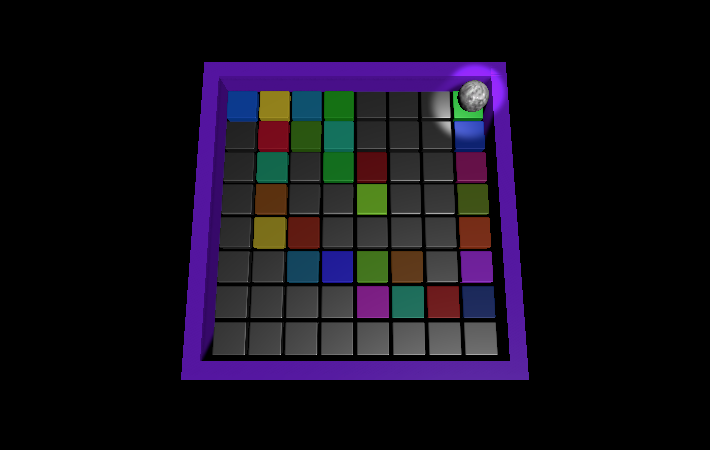

## What next?

If you are following the [More Unity](https://projects.raspberrypi.org/en/raspberrypi/more-unity) path, you can move on to the [Disco dance floor](https://projects.raspberrypi.org/en/projects/disco-dance-floor) project. In this project, you will make a tiltable disco dance floor with tiles that light-up and play musical notes when a ball rolls over them.

If you want to have more fun exploring Unity, then you could try out any of [these projects](https://projects.raspberrypi.org/en/projects?software%5B%5D=unity).

If you want to create your own material to add to your Rainbow run ball you could try out the [Blender - Add material effects to a marble](https://projects.raspberrypi.org/en/projects/blender-marble) project. 