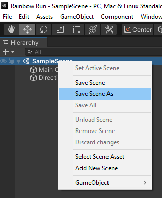
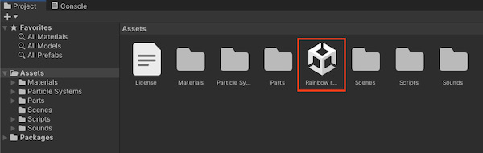
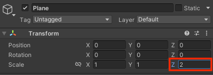
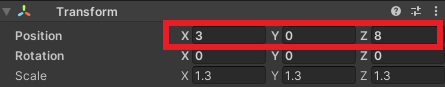
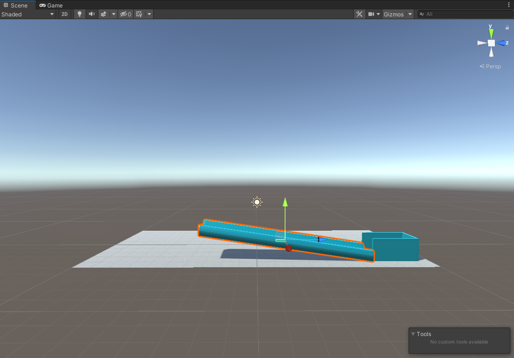

## Build the track

In this step, you will build a track from parts and add colourful materials.

{:width="350px"}

Some popular rolling ball games made with Unity include **Super Monkey Ball Banana Mania**, **Katamari Damacy REROLL**, **Hop** and **Rush**. In some rolling ball games and apps you control the ball and in others you tilt the floor to move the ball. Have you played any games with a rolling ball or marble?

A Unity project needs graphics and sound 'Assets'.  

--- task ---

Download and unzip the [More Unity starter package](https://rpf.io/p/en/rainbow-run-go){:target="_blank"} to your computer. Choose a sensible location such as your Documents folder. 

--- /task ---

--- task ---

Launch the Unity Hub and click **Projects** then select **New project**:

[A screenshot of the black bar at the top of the Unity Hub with the 'New Project' button highlighted in red.](images/new_project.png)

From the list choose **All templates** then select **3D Core**:

[A screenshot of the left pane in the Unity Hub. The 3D core option is highlighted in red.](images/3D-core.png)

Edit the project settings to give your project a sensible name and save it to a sensible location. Then click **Create project**:

[A screenshot of the right pane in the Unity Hub. The filename and the 'Create Project' sections are highlighted in red.](images/create-project.png)

Your new project will open in the Unity Editor. It may take some time to load.

--- /task ---

--- task ---

The Unity starter package you downloaded contains a number of **Assets** for you to use in your project.

To import them into your new project, click on the **Assets menu** and select **Import package > Custom Package…** then navigate to the downloaded Unity starter package.

--- /task ---

[[[unity-importing-a-package]]]

--- task ---

Right-click on **SampleScene** in the Hierarchy and choose **Save Scene As**. 

In the pop-up window, name your Scene `Rainbow run`:

A new file will appear in the Assets folder in the Project window:

--- /task ---

### Add a floor

--- task ---

Right-click on your scene (named Rainbow run) in the Hierarchy window and choose **GameObject** > **3D Object** > **Plane**.

This will create a ground for your track to sit on.

--- /task ---

--- task ---

Resize the **Z Scale** of the plane in the Inspector window to `2`:

--- /task ---

--- task ---

In the Project window, double-click on the 'Materials' folder and then 'Obstacle Materials'. **Drag** the 'Concrete' material to the plane. 

Your scene should look like this:

--- /task ---

### Create the track

--- task ---
Right-click on 'Persp' in the Scene gizmo and choose 'Top' to switch to top-down view. 

--- /task ---

--- task ---

In the Projects window, open the 'Parts' folder and drag a 'Goal' into the scene view. Drag the goal near to the top-right of the plane. 

You can either use the 'Move' tool to position the goal or enter the numbers X=, Y=, Z=.

--- /task ---

--- task ---

Change the perspective to 'Left' using the Scene gizmo. 

Use the 'View Tool' to drag the scene view so that you are looking down on the plane:

--- /task ---

--- task ---

--- /task ---

**Tip:** Your scene will autosave. You can also use 'File->Save' or <kbd>Ctrl+S</kbd> to save at any time. 

--- save ---
