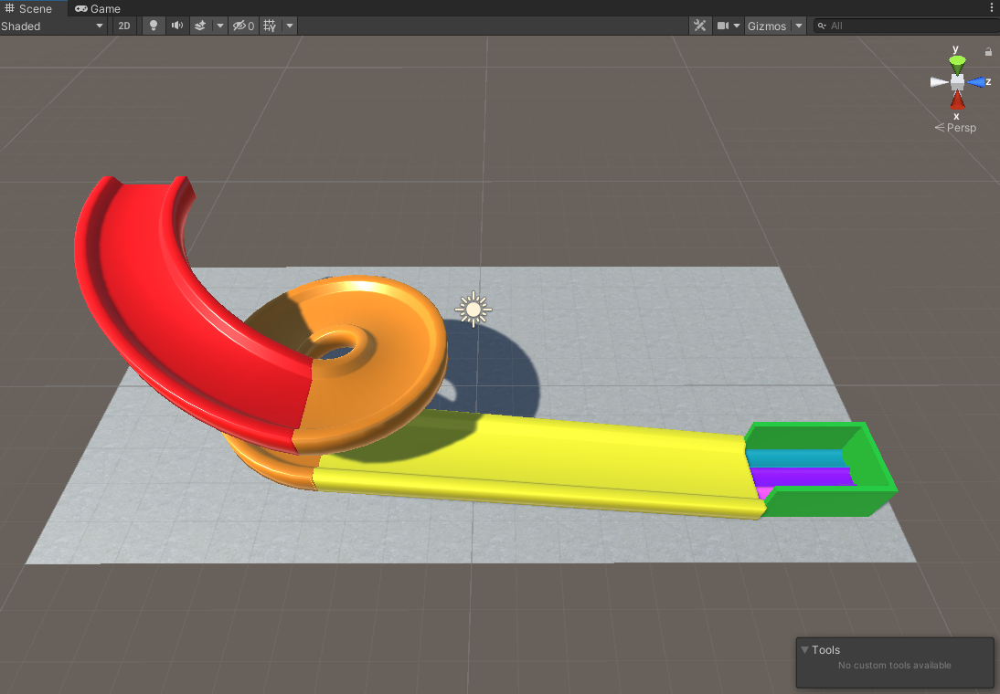

## Build the track

In this step, you will build a track from parts and add colourful materials.

{:width="350px"}

People are spending more time in **online virtual environments**. As well as playing games, people relax, explore, socialise, learn, and participate in interactive entertainment. Some people call the future of these environments the **metaverse**. Being able to design 3D worlds is an important skill.

A Unity project needs graphics and sound 'Assets'.  

--- task ---

Download and unzip the [More Unity starter package](https://CHANGE-LINK){:target="_blank"} to your computer. Choose a sensible location such as your Documents folder. 

--- /task ---

--- task ---

--- /task ---

--- save ---
