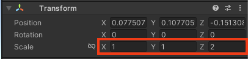
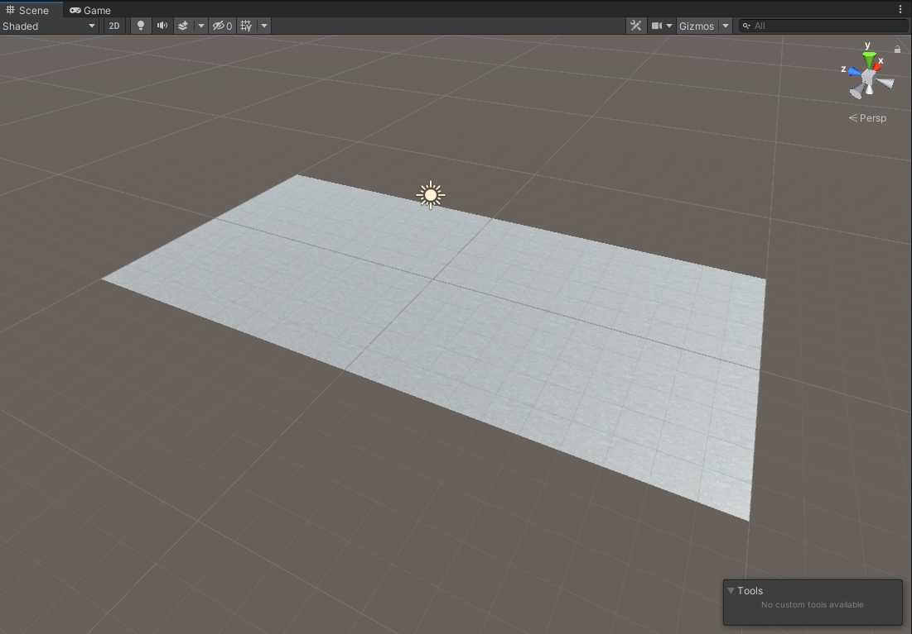

## Build the track

In this step, you will build a track from parts and add colourful materials.

{:width="350px"}

Many popular games have used **collapsing-platforms** to add an extra level of challenge. One classic game that introduced falling platforms is **Super Mario Bros**. Released in 1985, this iconic game had players navigating through levels filled with platforms that crumbled beneath Mario's feet. It set the stage for many future games to incorporate this thrilling mechanic including **Sonic the Hedgehog**, **Donkey Kong Country,** and *Crash Bandicoot**. Have you played any games that use a collapsing platform mechanic?

### Create a project with the starter package

A Unity project needs graphics and sound 'Assets'.  

--- task ---

Download and unzip the [More Unity starter package](https://rpf.io/p/en/rainbow-run-go){:target="_blank"} to your computer. 

**Tip:** Choose a sensible location such as your Documents folder. 

--- /task ---

--- task ---

Launch the Unity Hub and click **Projects** then select **New project**:

From the list choose **All templates** then select **3D Core**:

Edit the project settings to give your project a sensible name and save it to a sensible location. Then click **Create project**:

Your new project will open in the Unity Editor. It may take some time to load.

--- /task ---

--- task ---

The Unity starter package you downloaded contains a number of **Assets** for you to use in your project.

To import them into your new project, click on the **Assets menu** and select **Import package > Custom Package…** then navigate to the downloaded Unity starter package.

[[[unity-importing-a-package]]]

--- /task ---

--- task ---

Right-click on **SampleScene** in the Hierarchy and choose **Save Scene As**: 

In the pop-up window, name your Scene `Rainbow run`:

A new file will appear in the Assets folder in the Project window:

Drag the new `Rainbow run` Scene into the 'Scenes' folder to organise your files.

--- /task ---

### Add a floor

--- task ---

Right-click on your scene (named Rainbow run) in the Hierarchy window and choose **GameObject > 3D Object > Plane**.

This will create a ground for your track to sit on.

--- /task ---

--- task ---

Resize the **Z Scale** of the plane in the Inspector window to `2`:

--- /task ---

--- task ---

In the Project window, click on **Materials > Obstacle Materials**.

**Drag** the 'Concrete floor' material to the plane: 

Your scene should look like this:

--- /task ---

### Create the track

--- task ---

Right-click on **Persp** in the Scene gizmo and choose 'Top' to switch to top-down view:

You should now see your project from the top view. 

--- /task ---

--- task ---

In the Projects window, open the **Parts** folder and drag a 'Goal' into the Scene view. Position the goal near to the top-right of the plane. 

**Tip:** You can either use the 'Move' tool to position the goal or enter the transform position numbers X=`3`, Y=`0`, Z=`8`:

Your goal should now look like this:

--- /task ---

--- task ---

From the **Parts** folder, drag a 'StraightDown' into the Scene view. Position the ramp in front of the goal. 

**Tip:** You can either use the 'Move' tool to position the ramp or enter the transform position numbers X=`3`, Y=`1.5`, Z=`-3.3`:

--- /task ---

It is difficult to see the angle of the ramp from the top view.

--- task ---

Change the perspective to 'Right' using the Scene gizmo. 

You can move your view of the scene to see it from different angles. The best angle to view your track from is slightly higher than the pieces but angled down:

[[[unity-scene-navigation]]]

**Tip:** Remember, after navigating to the view you like best your view won't look exactly the same as our examples.

--- /task ---

--- task ---

From the **Parts** folder, drag a 'Spiral' into the Scene view. Position the spiral so it connects closely with the 'StraightDown' part. 

You can connect vertices (points) of two different objects in Unity by holding down the **V** key, hovering close to a vertex, and then dragging it towards the object you want to align with.

[[[unity-vertex-snapping]]]

An alternative way to position these two pieces together is to set the transform position of the Spiral to X=`3`, Y=`1.5`, Z=`-3.3`. 

--- collapse ---
---
title: Why are the coordinates for both objects the same?
---

Objects in Unity have a **Pivot point** used for the Transform position coordinates.

In this case the Pivot point for 'StraightDown' is at the top of the ramp and the Pivot point for 'Spiral' is at the bottom. This means the coordinates are the same for both pieces. 

--- /collapse ---

--- /task ---

--- task ---

From the **Parts** folder, drag a 'CurveDown' into the Scene view. Position the curved ramp so it connects closely with the 'Spiral' part. 

Use **Vertex snapping** to position your part.

Alternatively, you can use the coordinates X=`-2.37`, Y=`5.1`, Z=`-7.8`.

--- /task ---

--- task ---

Your course should look like the image below. This screenshot was taken from the **right** perspective.

--- /task ---

### Colour the track

--- task ---

**Choose:** a material for each piece in your track. 

In the Project window, go to **Materials**. Drag a coloured material onto each piece in the Scene view.   

We added rainbow colours. What will you choose? 

--- /task ---

**Tip:** Your scene will autosave. You can also use 'File->Save' or <kbd>Ctrl+S</kbd> to save at any time. 

--- save ---
