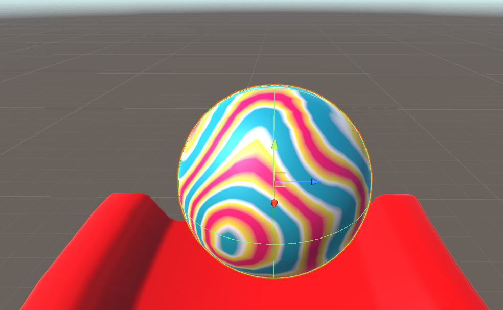
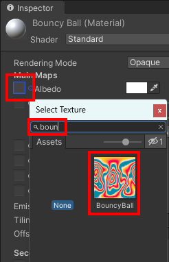

## Create a ball 

In this step, you will create a ball using a **Sphere** object. Then you will style the ball and make it bounce.

{:width="300px"}

--- task ---

Right-click in the Hierarchy window and choose **3D Object > Sphere**.

Name the new Sphere object 'Ball'.

--- /task ---

--- task ---

Set the scale of the 'Ball' to X=`0.25`, Y=`0.25`, Z=`0.25`.

**Tip:** You can use the 'link' button next to the scale property to change all the values at once.

--- /task ---

### Use gravity

--- task ---

Position the ball using the **Transform gizmo** so that it is slightly above the top of the ramp. 

Alternatively, you can use the Transform positions X=`-1`, Y=`6`, Z=`-7.7`.

--- /task ---

--- task ---

With the 'Ball' GameObject selected, choose 'Add Component' in the Inspector window and enter the text 'Rigidbody'. Select the 'Rigidbody' component. This adds a gravity effect to your ball. 

--- /task ---

--- task ---

Move your camera so you can see the whole track and the Ball. 

You can do this using the **Transform gizmo** and **Rotation gizmo** on the `Main Camera` GameObject. 

Or you can set the position and rotation in the Inspector to: 

Position: X=`11`, Y=`7`, Z=`9`

Rotation: X=`15`, Y=`-130`, Z=`0`

--- /task ---

--- task ---

Right-click on the 'Main Camera' object in the Hierarchy window.

Choose 'Align View to Selected'. This will match your Scene view and your Main Camera view. 

--- /task ---

--- task ---

Click **Play** and watch your ball roll slowly down the ramp.

Press the ‘Play’ button again to stop running your project.

--- /task ---

### Make the ball bounce

--- task ---

In the Project window, select **Materials > PhysicsMaterials**. 

Right-click in the window, click 'Create' and select **Physic Material**. 

--- /task ---

--- task ---

Name the material 'Bounce'.

--- /task ---

--- task ---

Change Bounciness to `1`.

--- /task ---

--- task ---

Select the 'Ball' GameObject and go to the Inspector window.

Find the 'Sphere Collider' properties and click on the small circle in the 'Material' section. 

Double-click on your new 'Bounce' Physics Material.

--- /task ---

--- task ---

Click **Play** and watch your ball bounce as it lands on the ramp.

--- /task ---

### Style your ball

--- task ---

In the Project window go to **Materials**. 

Right-click in the folder and select **Create > Material**.

Name your new material **BouncyBall**:

--- /task ---

--- task ---

Go to the Inspector window and select the small circle next to **Albedo**. Type `BouncyBall` to find the texture that has been included in your asset package. 

Click on the texture to add it to your new material.

--- /task ---

--- task ---

Drag your new 'BouncyBall' material to the ball in the Scene view. 

**Tip:** Use <kbd>Shift</kbd> and <kbd>F</kbd> on your keyboard to zoom in to the ball object so you can see the material clearly. 

--- /task ---