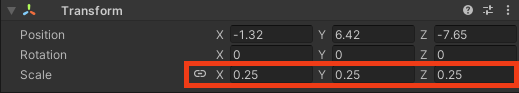
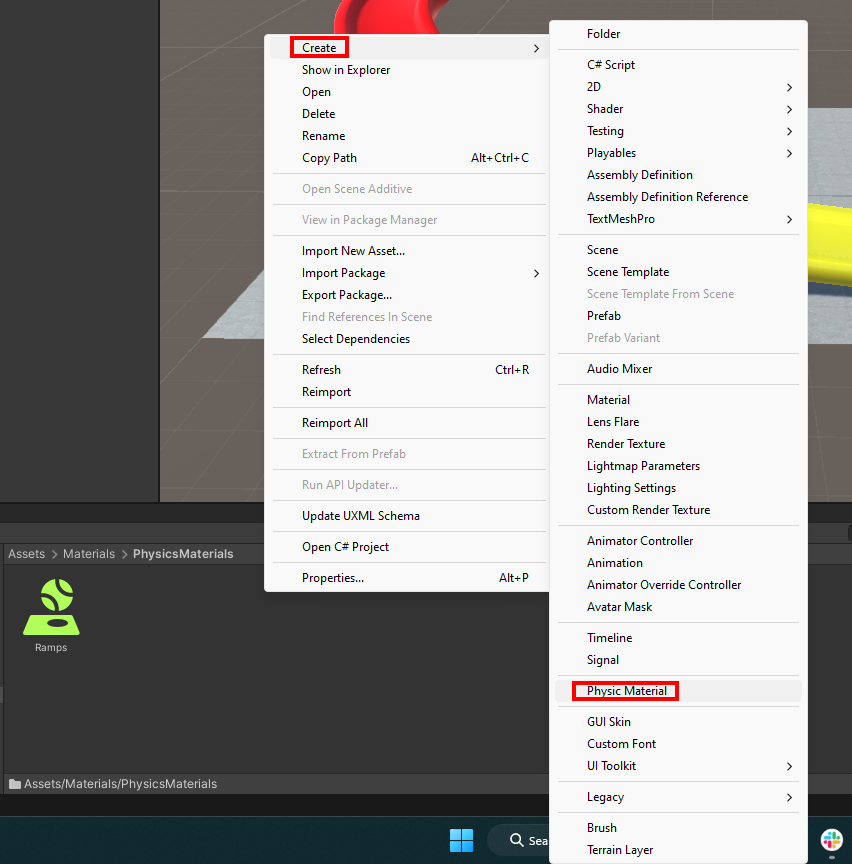

## Create a ball 

Create a ball using a **UV sphere** object. Style the ball and make it bounce.

{:width="300px"}

--- task ---

**Right-click** in the 'Hierarchy' and choose 'Create->GameObject->Sphere'.

**Name** the new Sphere object 'Ball'.

--- /task ---

--- task ---

Set the scale of the 'Ball' to X=`0.25`, Y=`0.25`, Z=`0.25`.

--- /task ---

### Use gravity

--- task ---

Position the ball using the **transform gizmo** so that it is slightly above the top of the ramp. 

Alternatively, you can use the transform positions X=`-1`, Y=`6`, Z=`-7.7`.

--- /task ---

--- task ---

With the 'Ball' GameObject selected, choose 'Add Component' in the inspector window and enter the text 'RigidBody'. Select the 'RigidBody' component. This adds a gravity effect to your ball. 

--- /task ---

--- task ---

Right-click on the 'MainCamera' object in the 'Hierarchy'.

Choose 'Align with view'. This will match your Scene view and your Main Camera view. 

--- /task ---

--- task ---

Click **Play** and watch your ball roll slowly down the ramp. 

--- /task ---

### Make the ball bounce

--- task ---

In the Project window select 'Materials' and then 'PhysicsMaterials'. Right-click in the window, click 'Create' and select **Physic Material**. 

--- /task ---

--- task ---

Name the material 'Bounce'.

--- /task ---

--- task ---

Change Bounciness to `1`.

--- /task ---

--- task ---

Select the 'Ball' GameObject and go to the Inspector window.

Find the 'Sphere Collider' properties and click on the small circle in the 'Material' section. 

Double-click on your new 'Bounce' physics material.

--- /task ---

--- task ---

Click **Play** and watch your ball bounce as it lands on the ramp.

--- /task ---

### Style your ball

--- task ---

In the Project window go to **Materials > BallMaterials**. 

Right-click in the folder and select **Create > Material**.

Name your new material **BouncyBall**:

--- /task ---

--- task ---

Go to the Inspector window and select the small circle next to **Albedo**. Type `BouncyBall` to find the texture that has been included in your asset package. 

Click on the texture to add it to your new material.

--- /task ---

--- task ---

Drag your new 'BouncyBall' material to the ball in the Scene view. 

**Tip:** Use <kbd>shift</kbd> and <kbd>f</kbd> on your keyboard to zoom in to the ball object so you can see the material clearly. 

--- /task ---