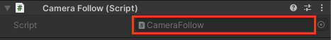

## Control the camera

In this step, you will create a script to control the camera and follow the ball down the track.

{:width="300px"}

### Position your camera

--- task ---

Go to the Hierarchy window. Click on the 'Main Camera'. A small Main Camera view window will appear showing the view the camera sees:

Change the transform position and rotation of the Main Camera to:

Position: X=`-2.5` , Y=`7`, Z=`-7.9`
Rotation: X=`24` , Y=`90`, Z=`0`

The camera should be behind the ball and facing slightly down the ramp. 

--- /task ---

--- task ---

Go to the Hierarchy window. Right-click on the 'Main Camera' and select **Align View to Selected**. 

--- /task ---

### Follow the ball 

--- task ---

Go to the Inspector window for the 'Main Camera' and click on the **Add Component** button. Type `script` and select **New Script**. Name your new script `CameraController`, then press <kbd>Enter</kbd>.

--- /task ---

--- task ---

Go to the Project window. The new script will be saved in the Assets folder:

Drag the new script to the 'Scripts' folder to organise your files:

--- /task ---

--- task ---

Double click on 'CameraController' script. The script will open in a separate code editor. 

Copy or type this code to make the Main Camera look at the ball and move with the ball as the ball rolls down the track:

--- code ---
---
language: cs
filename: CameraController.cs
line_numbers: true
line_number_start: 1
line_highlights: 
---

using System.Collections;
using System.Collections.Generic;
using UnityEngine;

public class CameraController : MonoBehaviour
{
  public GameObject ball;
  private Vector3 prevBallPos;

  void Start()
  {
      // Calculate where the camera is in relation to the player (ball)
      transform.LookAt(ball.transform);
      prevBallPos = ball.transform.position;
  }

  void LateUpdate()
  {
       // Moves the camera by the same amount the ball has moved
       transform.Translate(ball.transform.position - prevBallPos, Space.World);
       prevBallPos = ball.transform.position;
  }
}

--- /code ---

--- /task ---

--- task ---

Save your script and switch back to the Unity Editor and click on the 'Main Camera' GameObject in the Hierarchy window.

Find the 'Ball' property of the Main Camera's CameraController script in the Inspector window.

Click on the circle to the right of the Ball property and choose the 'Ball' GameObject':

--- /task ---

--- task ---

**Test:** Select the Game view tab and click on the 'Play' button to run your project.  

The ball will roll down the track and the camera will follow it. 

--- /task ---

### Control the view

--- task ---

Press the 'Play' button again to stop running your project. 

Double click on 'CameraController' script and add code to use the mouse position to control the camera rotation angle:

--- code ---
---
language: cs
filename: CameraController.cs
line_numbers: true
line_number_start: 1
line_highlights: 7, 20, 21, 22, 23
---

using System.Collections;
using System.Collections.Generic;
using UnityEngine;

public class CameraController : MonoBehaviour
{
  public float sensitivity = 5f;
  public GameObject ball;
  private Vector3 prevBallPos;

  void Start()
   {
       // Calculate where the camera is in relation to the player (ball)
       transform.LookAt(ball.transform);
       prevBallPos = ball.transform.position;
   }

void LateUpdate()
   {
       float mouse = Input.GetAxis("Mouse Y");
       transform.Rotate(new Vector3(mouse * sensitivity * -1, 0, 0));
       float look = Input.GetAxis("Mouse X") * sensitivity;
       transform.RotateAround(ball.transform.position, Vector3.up, look);
       // Moves the camera by the same amount the ball has moved
       transform.Translate(ball.transform.position - prevBallPos, Space.World);
       prevBallPos = ball.transform.position;
   }
}

--- /code ---

--- /task ---

--- task ---

**Test:** Save your script and switch back to the Unity Editor. Select the Game view tab and click on the 'Play' button to run your project.  

The camera will still follow the ball down the track but you can now control the view by moving your mouse to the left and right, up and down. 

Press the 'Play' button again to stop running your project. 

--- /task ---