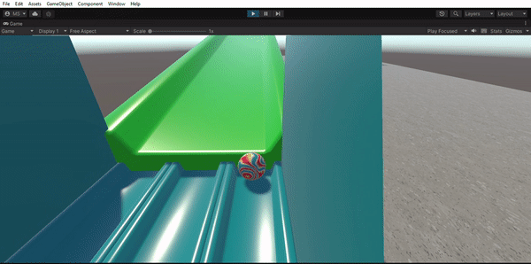
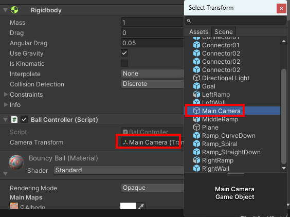
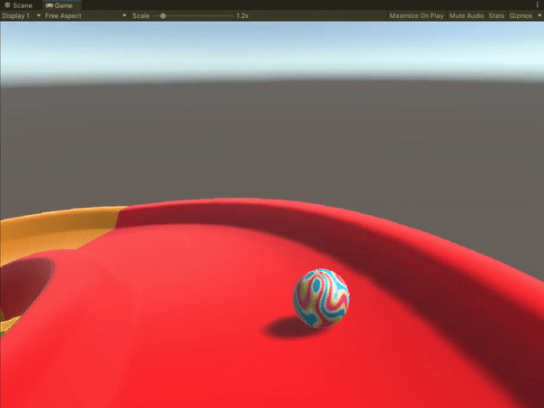

## Control the ball

In this step, you will create a script that uses the keyboard to control the ball.

{:width="300px"}

Around the world people use different computer keyboard layouts and this can impact the common keys used for navigation. An example of this is in the **<kbd>QWERTY</kbd>** and **<kbd>AZERTY</kbd>** layouts. A <kbd>QWERTY</kbd> keyboard user will likely use keys **<kbd>WASD</kbd>** to move around in a game but an <kbd>AZERTY</kbd> keyboard user will likely use keys **<kbd>ZQSD</kbd>**. These are just two examples, which keys would you use? 

### Apply force on key press

--- task ---

Go to the Inspector window for the 'Ball' and click on the **Add Component** button. Type `BallController` and  press <kbd>Enter</kbd> **twice** to create a new `BallController` script.

--- /task ---

--- task ---

Go to the Project window. The new script will be saved in the Assets folder.

Drag the new script to the 'Scripts' folder to organise your files.

--- /task ---

--- task ---

Double click on the 'BallController' script. Copy or type this code to make the Ball move to the left when you press <kbd>A</kbd> and right when you press <kbd>D</kbd>:

**Choose:** These instructions are based on using the keys <kbd>WASD</kbd> to control movement. If you want to use different keys you can change `Input.GetKey("a")` and `Input.GetKey("d")` to the keys you want to use. 

--- collapse ---
---
title: I want to use different keys
---

If you want to know the naming conventions to use for the other keys on your keyboard then you can visit the [Unity Documentation](https://docs.unity3d.com/Manual/class-InputManager.html){:target="_blank"}.

--- /collapse ---

--- code ---
---
language: cs
filename: BallController.cs
line_numbers: true
line_number_start: 1
line_highlights: 
---

using System.Collections;
using System.Collections.Generic;
using UnityEngine;

public class BallController : MonoBehaviour
{
   private Rigidbody rb;
   public Transform cameraTransform;
   public string rightKey;
   public string leftKey;

   // Start is called before the first frame update
   void Start()
   {
       rb = this.GetComponent<Rigidbody>();
       rb.transform.forward = cameraTransform.forward;

   }

   // FixedUpdate is called once per fixed frame-rate frame
   void FixedUpdate()
   {  
       // Calculates cameraTransform.forward without the y value so the ball doesn't move up and down on the Y axis
       Vector3 forward = new Vector3(cameraTransform.forward.x, 0, cameraTransform.forward.z).normalized;
       Vector3 right =  Quaternion.AngleAxis(90, Vector3.up) * forward;
       Vector3 left = -right;

       if (Input.GetKey(rightKey))
       {
           rb.AddForce(right * 5f);
       }

       if (Input.GetKey(leftKey))
       {
           rb.AddForce(left * 5f);
       }
   } 
}

--- /code ---

--- /task ---

--- task ---

Save your script and switch back to the Unity Editor and click on the 'Ball' GameObject in the Hierarchy window.

Find the 'Camera Transform' property of the Ball's BallController script in the Inspector window.

Click on the circle to the right of the Camera Transform property and choose the 'Main Camera' GameObject':

You can also set which keys you would like to use for the right and left controls. 

You can use `d` for right and `a` for left - the letters **have to** be lowercase. 

If you would like to use the arrow keys you can enter `right` and `left`.

Use whichever keys make sense for your keyboard.

--- /task ---

--- task ---

**Test:** Select the Game view tab and click on the 'Play' button to run your project.  

Use the <kbd>A</kbd> and <kbd>D</kbd> keys to move the ball to the left and right. 

Press the 'Play' button again to stop running your project. 

--- /task ---

--- task ---

Go back to your 'BallController' script and add code to FixedUpdate to give your ball a turbo boost forward when you press <kbd>W</kbd> and go backward when you press <kbd>S</kbd>:

**Tip**: Choose the keys that suit your needs. 

--- code ---
---
language: cs
filename: BallController.cs
line_numbers: true
line_number_start: 7
line_highlights: 11, 12, 37-43
---
private Rigidbody rb;
public Transform cameraTransform;
public string rightKey;
public string leftKey;
public string upKey;
public string downkey;

// Start is called before the first frame update
void Start()
{
    rb = this.GetComponent<Rigidbody>();
    rb.transform.forward = cameraTransform.forward;
}

// Update is called once per frame
void FixedUpdate()
{
    Vector3 forward = new Vector3(cameraTransform.forward.x, 0, cameraTransform.forward.z).normalized;
    Vector3 right = Quaternion.AngleAxis(90, Vector3.up) * forward;
    Vector3 left = -right;
    Vector3 backward = -forward;

    if (Input.GetKey(rightKey)){
        rb.AddForce(right * 5f);
    }

    if (Input.GetKey(leftKey)){
        rb.AddForce(left * 5f);
    }

    if (Input.GetKey(upKey)){
        rb.AddForce(forward * 10f);
    }

    if (Input.GetKey(downKey)){
        rb.AddForce(backward * 2f);
    }
}

--- /code ---

--- /task ---

--- task ---

**Test:** Save your script and switch back to the Unity Editor. Select the Game view tab and click on the 'Play' button to run your project.  

Use the keys you set in the Inspector to move the ball up, left, down and right. Can you use your turbo to fly off the track?

Press the 'Play' button again to stop running your project.

**Debug:** if your left or backwards keys are not working, double check you have the `-` in front of `right` and `forward` when setting the variables.

--- /task ---