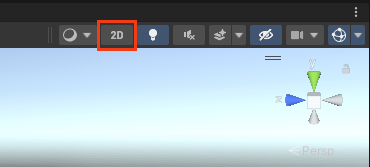
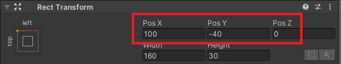
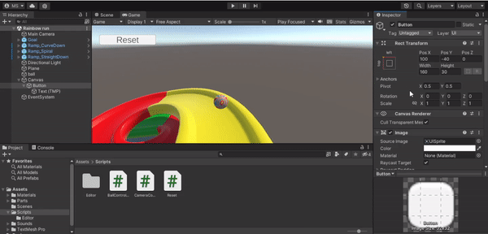

## Add a reset button

In this step, you will add a reset button to respawn your ball at the top of the track.

{:width="300px"}

--- task ---

**Right-click** in the 'Hierarchy' and choose **UI > Button - TextMeshPro**.

**Tip:** You might see a popup window to 'Import TMP' Essentials' and 'Import TMP Examples & Extras'. If so click on both buttons to use TextMeshPro.

--- /task ---

--- task ---

Click on the '2D' icon at the top of the Scene view: 

Go to the Hierarchy window and select the 'Canvas'.

Press <kbd>shift</kbd> and <kbd>f</kbd> on your keyboard to focus the Scene view on the Canvas:

**Note:** Your button might not be in the bottom left corner. This is fine as you are about to change its location.

--- /task ---

--- task ---

Go to the Hierarchy window and click on the arrow next to 'Button'. Select 'Text (TMP)':

In the Inspector window, find the 'Text Input' box and type `Reset`:

--- /task ---

--- task ---

Go to the Hierarchy window and click on the 'Button' GameObject. 

From the 'Rect Transform' component in the Inspector, select the 'Anchor Presets' icon and click **top left**: 

In the Inspector window, change the 'Rect transform' of the button to Pos X=`100`, Pos Y=`-40`, Pos Z=`0`:

--- /task ---

--- task ---

**Test:** Switch your editor back out of 2D mode by clicking the same icon in the top of the 'Scene' view. 

Select the Game view tab and click on the 'Play' button to run your project.  

Your button will appear in the top left corner. You can change the Rect Transform coordinates until you find the position you like best. 

Press the 'Play' button again to stop running your project. 

--- /task ---

### Add code to your button

--- task ---

Click on the 'Ball' GameObject in the Hierarchy window. Press <kbd>Shift</kbd> and <kbd>F</kbd> on your keyboard to focus the Scene view on the Ball: 

Go to the Inspector and click on the **Add Component** button. Type `Reset` and press <kbd>Enter</kbd> **twice** to create a new script called `Reset`.

--- /task ---

--- task ---

Go to the Project window. The new script will be saved in the Assets folder.

Drag the new script to the 'Scripts' folder to organise your files.

--- /task ---

--- task ---

Double click on the 'Reset' script. Copy or type this code to make the Ball respawn at the top of the track when you press the Reset button:

--- code ---
---
language: cs
filename: Reset.cs
line_numbers: true
line_number_start: 1
line_highlights: 
---

using System.Collections;
using System.Collections.Generic;
using UnityEngine;
public class Reset : MonoBehaviour
{
    Vector3 spawnPoint;
    private Rigidbody rb;

    // Start is called before the first frame update
    void Start()
    {
        rb = GetComponent<Rigidbody>();
        spawnPoint = transform.position;
    }

    // Update is called once per frame
    void Update()
    {

    }

    public void resetBall()
    {
        rb.velocity = Vector3.zero;
        transform.position = spawnPoint;
    }
}

--- /code ---

--- /task ---

--- task ---

Go to the Hierarchy window and click on the 'Button' GameObject. 

In the Inspector window, scroll down until you see the 'On Click()' component.

Click on the the **+** sign to create a new action.

Drag the  'Ball' GameObject from the Hierarchy window to the Object property of the action. 

Click on the function property and select **Reset > resetBall()** to call the resetBall method from your Reset script:

--- /task ---

--- task ---

**Test:** Press 'Play' and watch your ball roll down the track. Then press your reset button and notice that the ball returns to the top of the track.

Press the 'Play' button again to stop running your project. 

--- /task ---
