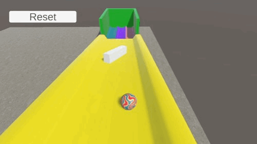
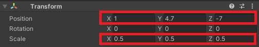
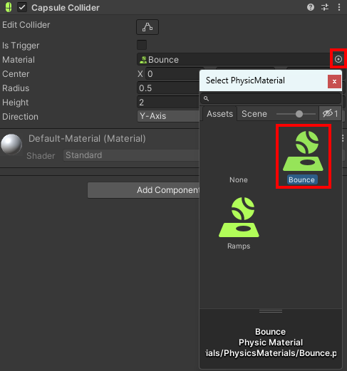
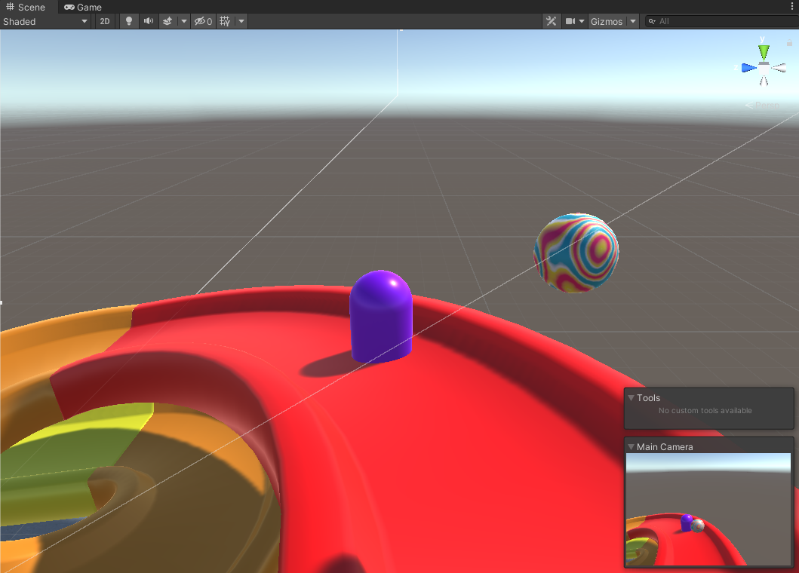
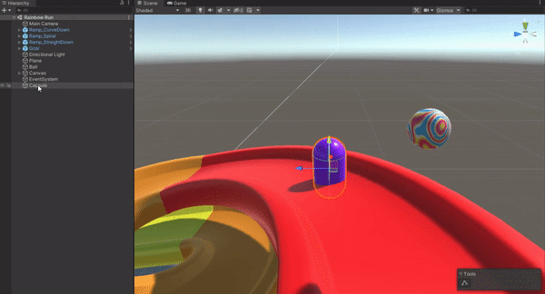
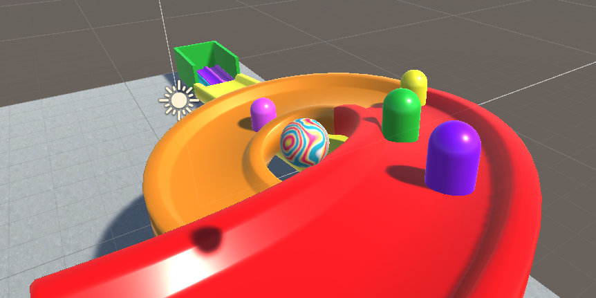
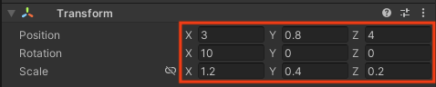
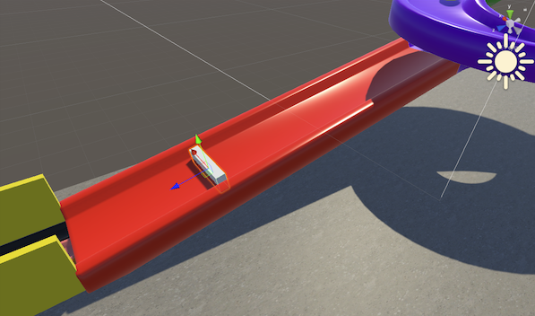
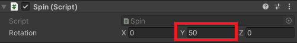

## Add moving obstacles 

In this step, you will create bouncy and spinning obstacles along your track.

{:width="300px"}

### Bouncy capsules

--- task ---

**Right-click** in the 'Hierarchy' and choose **3D Object > Capsule**.

Set the **scale** of the 'Capsule' to X=`0.5`, Y=`0.5`, Z=`0.5`.

Set the **position** of the 'Capsule' to X=`1`, Y=`4.7`, Z=`-7`.

--- /task ---

--- task ---

Click on the circle next to the Material property in the Capsule Collider component and select 'Bounce':

--- /task ---

--- task ---

**Choose:** a material to style your capsule. 

In the Project window, go to **Materials**. Drag a coloured material onto the capsule in Scene view.   

--- /task ---

--- task ---

**Test:** Press 'Play' and collide with the capsule to see the bounce material on both the ball and the obstacle combine to bounce the ball away from the obstacle. 

Press the 'Play' button again to stop running your project. 

--- /task ---

--- task ---

Right-click on the Capsule GameObject in the Hierarchy window and select 'Duplicate'.

Use the move tool to drag the new capsule to another position. 

**Choose:** Add more coloured bouncy capsule obstacles. You can add as many as you like - but remember there has to be a way for your ball to get through.

**Tip:** You can change the scale of each capsule to add variety to your track.

--- /task ---

### An obstacle that spins

--- task ---

**Right-click** in the 'Hierarchy' and choose **3D Object > Cube**.

Set the **position** of the 'Cube' to X=`3`, Y=`0.8`, Z=`4.2`.

Set the **rotation** of the 'Cube' to X=`10`, Y=`0`, Z=`0`.

Set the **scale** of the 'Cube' to X=`1.2`, Y=`0.4`, Z=`0.2`.

--- /task ---

--- task ---

Rename the Cube object to 'SpinningCube'.

--- /task ---

--- task ---

**Choose:** a material to for your spinning cube. 

--- /task ---

--- task ---

Go to the Inspector window for the 'SpinningCube' and click on the **Add Component** button. Type `Spin` and  click 'New Script' - and then hit <kbd>Enter</kbd> or click 'Create and Add'.

--- /task ---

--- task ---

Go to the Project window. The new script will be saved in the Assets folder.

Drag the new script to the 'Scripts' folder to organise your files.

--- /task ---

--- task ---

Double click on the 'Spin' script. Copy or type this code to make the cube spin when your game is in play:

--- code ---
---
language: cs
filename: Spin.cs
line_numbers: true
line_number_start: 1
line_highlights:
---

using System.Collections;
using System.Collections.Generic;
using UnityEngine;

public class Spin : MonoBehaviour
{
    public Vector3 rotation;

    // Start is called before the first frame update
    void Start()
    {
       
    }

    // Update is called once per frame
    void Update()
    {
        transform.Rotate(rotation * Time.deltaTime); 
    }
}

--- /code ---

--- collapse ---

---
title: What is Time.deltaTime?
---

The way Unity runs your game is by both drawing images and calling `Update()` repeatedly. This is called a **frame**. 

You may have heard gamers talk about the **frame-rate** used by the games they play, usually described as 'fps' (frames per second).

`Time.deltaTime` returns the amount of time that has passed since the last frame, and you can use it in your programs to smooth the movement and rotation of your GameObjects.

--- /collapse ---

--- /task ---

--- task ---

Save your script and switch back to the Unity Editor. Go to the Inspector for the SpinningCube. In the 'Spin' script component change the Rotation Y value to `50`: 

--- /task ---

--- task ---

**Test:** Press 'Play' and navigate to the end of your track. 

Press the 'Play' button again to stop running your project. 

--- /task ---

--- task ---

**Choose:** You can use the Spin component to change the Rotation on X, Y or Z. Try spinning on a different axis or changing the value to increase or decrease the speed. 

--- /task ---
